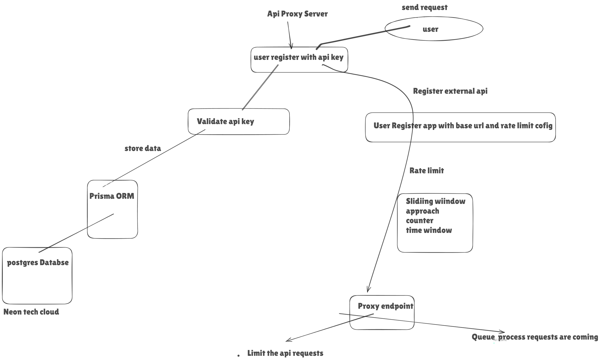

# Rate Limiting Proxy API - Take Home Assignment

This application is based on the user based authentication and rate limiting for api requests

As we know rate limit works om the application rather than the server

- Allow user to register with jwt based system
- Create app with rate limits
- proxy requests to external api

We created a rate limiting API proxy server where user will access third party api by proxy server whenever the user authenticate we give him a apikey
means we register user with apikey as an app

In that that app register we confgiure rate limiting , user is access the apikey with our proxy server and limit the api key requests and process the requests in the queue

The application implements two layers of rate limiting:

- Limits requests to a maximum of 100 requests every 15 minutes for all users.
- Each registered application has its own configurable rate limit based on registration.

## Instructions

Clone the Repository:

git clone https://github.com/Anantdadhich/proxy_server

Install Dependencies:

npm install

Setup Environment Variables:

Create a .env file in the root directory and add the following:

JWT_SECRET=your_secret_key
DATABASE_URL=your_database_url

Run Database Migrations:

npx prisma migrate dev

Start the Server:

## API Endpoints

### **/auth**

**Method:** `POST`

register user endpoint and provides an API key.

**Request Body:**

{
"username": "your_username"
}

### **/registerapi**

**Method:** `POST`

Registers an external API with rate limiting configuration. Requires an API key in the headers.

**Headers:**

{
"x-api-key": "your_api_key"
}

**Request Body:**

{
"baseUrl": "https://your-api.com",
"ratelimitconfig": {
"requestcount": 100,
"timewindow": 60000,
"strategy": "window"
}
}

### **/apis/:apiid/**

**Method:** `ANY`

Proxies requests to the registered API with rate limiting enforced.

**Headers:**
{
"x-api-key": "your_api_key"
}

## Rate Limiting Strategy Used

### **1. Fixed Window Counter**

Implemented using `express-rate-limit`:

- Limits requests to 100 per 15 minutes globally for all users.

### **2. Sliding Window Log (Custom Implementation)**

- We use both counter and log:  
  requestcount: Maximum number of requests allowed.

timewindow: Time period for the rate limit in milliseconds.

### **3. Queue Implementation**

- Limit number of Request given period of time
- Uses the `queue` library with a concurrency of 1 to ensure requests are rate-limited and processed one at a time.

---

Architecture

Screenshots
